# Module 1 Homework: Docker & SQL

## Question 1. Understanding Docker images

Run docker with the `python:3.13` image. Use an entrypoint `bash` to interact with the container.

What's the version of `pip` in the image?

<b>ANSWER : 25.3</b>

```bash
docker run -it --entrypoint //bin/bash taxi_ingest:v001
root@ce5ca0e6085e:/code# pip --version


#OUTPUT
pip 25.3 from /usr/local/lib/python3.13/site-packages/pip (python 3.13)

#OR

docker run --rm --entrypoint pip taxi_ingest:v001 --version
#OUTPUT
pip 25.3 from /usr/local/lib/python3.13/site-packages/pip (python 3.13)
```

## Question 2. Understanding Docker networking and docker-compose

Given the following `docker-compose.yaml`, what is the `hostname` and `port` that pgadmin should use to connect to the postgres database?


```yaml
services:
  db:
    container_name: postgres
    image: postgres:17-alpine
    environment:
      POSTGRES_USER: 'postgres'
      POSTGRES_PASSWORD: 'postgres'
      POSTGRES_DB: 'ny_taxi'
    ports:
      - '5433:5432'
    volumes:
      - vol-pgdata:/var/lib/postgresql/data

  pgadmin:
    container_name: pgadmin
    image: dpage/pgadmin4:latest
    environment:
      PGADMIN_DEFAULT_EMAIL: "pgadmin@pgadmin.com"
      PGADMIN_DEFAULT_PASSWORD: "pgadmin"
    ports:
      - "8080:80"
    volumes:
      - vol-pgadmin_data:/var/lib/pgadmin

volumes:
  vol-pgdata:
    name: vol-pgdata
  vol-pgadmin_data:
    name: vol-pgadmin_data
```
<b> ANSWER:
<div align="center">
  
</div>

- localhost:5432
- db:5432
</b>

## Question 3. Counting short trips

For the trips in November 2025 (lpep_pickup_datetime between '2025-11-01' and '2025-12-01', exclusive of the upper bound), how many trips had a `trip_distance` of less than or equal to 1 mile?
```SQL
SELECT COUNT(trip_distance)
FROM green_taxi_data
WHERE lpep_pickup_datetime BETWEEN '2025-11-01' AND '2025-12-01'
AND trip_distance <= 1
```


<b>ANSWER: 8,007</b>

```mermaid
graph TD
    Step1[FROM green_taxi_data]
    
    %% Étape de filtrage temporel
    Step1 --> Step2{"WHERE lpep_pickup_datetime <br/> BETWEEN '2025-11-01' AND '2025-12-01'"}
    
    %% Étape de filtrage de distance
    Step2 --> Step3{"AND trip_distance <= 1"}
    
    %% Étape de comptage
    Step3 --> Step4["SELECT COUNT(trip_distance)"]
    
    %% Résultat
    Step4 --> Step5([Résultat : Nombre de trajets])
```

## Question 4. Longest trip for each day

Which was the pick up day with the longest trip distance? Only consider trips with `trip_distance` less than 100 miles (to exclude data errors).

Use the pick up time for your calculations.

```SQL
SELECT 
    trip_distance,
    lpep_pickup_datetime
FROM green_taxi_data
WHERE trip_distance < 100
ORDER BY trip_distance DESC
LIMIT 1;
```

<b>ANSWER: 2025-11-14</b>


## Question 5. Biggest pickup zone

Which was the pickup zone with the largest `total_amount` (sum of all trips) on November 18th, 2025?

```SQL
SELECT SUM(g.total_amount) as t,
g."PULocationID",
z."Zone"
FROM green_taxi_data g
JOIN zones z
ON g."PULocationID" = z."LocationID"
WHERE DATE(lpep_pickup_datetime) = '2025-11-18'
GROUP BY "PULocationID", "Zone"
ORDER BY t DESC
LIMIT 1;

-- OR WHERE
WHERE g.lpep_pickup_datetime >= '2025-11-18 00:00:00' 
  AND g.lpep_pickup_datetime < '2025-11-19 00:00:00'
```


<b>ANWSER: - East Harlem North</b>


## Question 6. Largest tip

For the passengers picked up in the zone named "East Harlem North" in November 2025, which was the drop off zone that had the largest tip?

Note: it's `tip` , not `trip`. We need the name of the zone, not the ID.


<b>ANSWER: - Yorkville West </b>

```SQL
SELECT 
    z."Zone" as dropoff_zone,
    MAX(g.tip_amount) as max_tip,
    g.lpep_pickup_datetime
FROM green_taxi_data g
JOIN zones z
    ON g."DOLocationID" = z."LocationID"
WHERE 
    -- 1. Filtering for the month -> extract year and month
    TO_CHAR(g.lpep_pickup_datetime, 'YYYY-MM') = '2025-11'
    
    -- 2. sub query PUlocation to text zone
    AND g."PULocationID" = (
        SELECT "LocationID" 
        FROM zones 
        WHERE "Zone" = 'East Harlem North'
    )
-- 3. GROUP BY with aggregation MAX
GROUP BY z."Zone",g. lpep_pickup_datetime
ORDER BY max_tip DESC
LIMIT 1;
```


## Terraform

In this section homework we'll prepare the environment by creating resources in GCP with Terraform.

In your VM on GCP/Laptop/GitHub Codespace install Terraform.
Copy the files from the course repo
[here](../../../01-docker-terraform/terraform/terraform) to your VM/Laptop/GitHub Codespace.

Modify the files as necessary to create a GCP Bucket and Big Query Dataset.


## Question 7. Terraform Workflow

Which of the following sequences, respectively, describes the workflow for:
1. Downloading the provider plugins and setting up backend,
2. Generating proposed changes and auto-executing the plan
3. Remove all resources managed by terraform`

Answers:
- terraform import, terraform apply -y, terraform destroy
- teraform init, terraform plan -auto-apply, terraform rm
- terraform init, terraform run -auto-approve, terraform destroy
- terraform init, terraform apply -auto-approve, terraform destroy
- terraform import, terraform apply -y, terraform rm


## Submitting the solutions

* Form for submitting: https://courses.datatalks.club/de-zoomcamp-2026/homework/hw1


## Learning in Public

We encourage everyone to share what they learned. This is called "learning in public".

### Why learn in public?

- Accountability: Sharing your progress creates commitment and motivation to continue
- Feedback: The community can provide valuable suggestions and corrections
- Networking: You'll connect with like-minded people and potential collaborators
- Documentation: Your posts become a learning journal you can reference later
- Opportunities: Employers and clients often discover talent through public learning

You can read more about the benefits [here](https://alexeyondata.substack.com/p/benefits-of-learning-in-public-and).

Don't worry about being perfect. Everyone starts somewhere, and people love following genuine learning journeys!

### Example post for LinkedIn

```
🚀 Week 1 of Data Engineering Zoomcamp by @DataTalksClub complete!

Just finished Module 1 - Docker & Terraform. Learned how to:

✅ Containerize applications with Docker and Docker Compose
✅ Set up PostgreSQL databases and write SQL queries
✅ Build data pipelines to ingest NYC taxi data
✅ Provision cloud infrastructure with Terraform

Here's my homework solution: <LINK>

Following along with this amazing free course - who else is learning data engineering?

You can sign up here: https://github.com/DataTalksClub/data-engineering-zoomcamp/
```

### Example post for Twitter/X


```
🐳 Module 1 of Data Engineering Zoomcamp done!

- Docker containers
- Postgres & SQL
- Terraform & GCP
- NYC taxi data pipeline

My solution: <LINK>

Free course by @DataTalksClub: https://github.com/DataTalksClub/data-engineering-zoomcamp/
```

