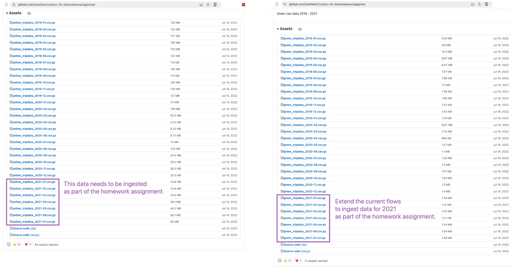
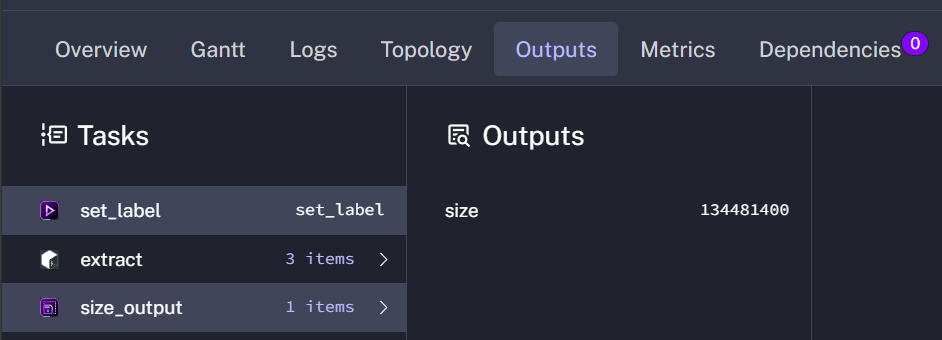
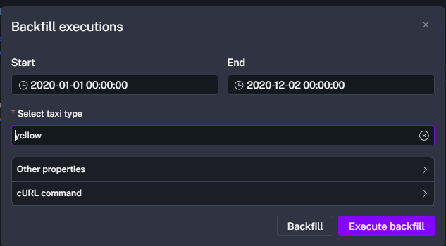
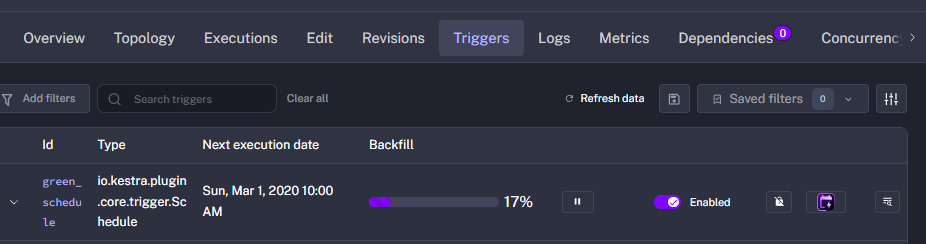
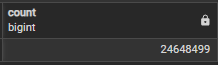
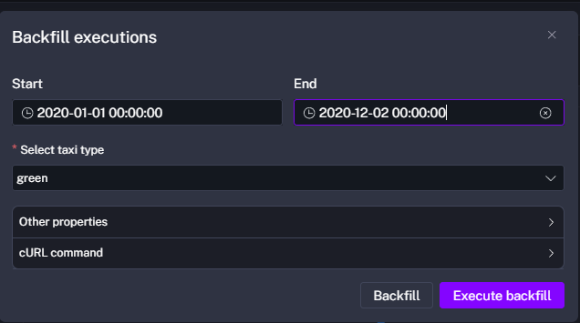
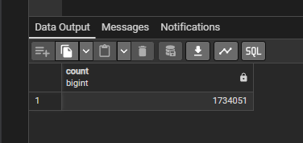
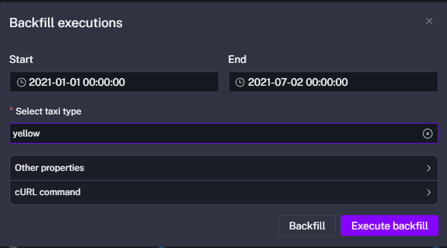
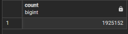

## Module 2 Homework

> In case you don't get one option exactly, select the closest one 

For the homework, we'll be working with the _green_ taxi dataset located here:

`https://github.com/DataTalksClub/nyc-tlc-data/releases/tag/green/download`

To get a `wget`-able link, use this prefix (note that the link itself gives 404):

`https://github.com/DataTalksClub/nyc-tlc-data/releases/download/green/`

### Assignment

Data year 2019 and 2020 + a part of 2021.



# Quiz Questions

## *1) Within the execution for `Yellow` Taxi data for the year `2020` and month `12`: what is the uncompressed file size (i.e. the output file `yellow_tripdata_2020-12.csv` of the `extract` task)?*

<b>
<div style="color: #5bde7e;">
Add this after extract in the kestra flow:

 - id: size_output
    type: io.kestra.plugin.core.storage.Size
    uri: "{{ outputs.extract.outputFiles[inputs.taxi ~ '_tripdata_' ~ inputs.year ~ '-' ~ inputs.month ~ '.csv'] }}"

<div align="center">
  
</div>

When the prompt appears configure month: 12 and year: 2020

<div align="center">
  
</div>

1 MiB = 1024 x 1024 byte = 1 048 576 bytes

134481400 byte(octet) = 134,4814 MegaByte (Megaoctet)
BUT 1 MB = 0,953674 MiB (mebioctet)

134481400 byte / 1 048 576 bytes(1MiB)
OR
134,4814 MB * 0,953674 MiB

-> = 128,251457214 MiB

### <u>ANSWER: 128.3 MiB</u>
</div>
</b>


## *2) What is the rendered value of the variable `file` when the inputs `taxi` is set to `green`, `year` is set to `2020`, and `month` is set to `04` during execution?*

<b>
<div style="color: #5bde7e;">

 ### <u>ANSWER: green_tripdata_2020-04.csv</u>

variables:
  file: "{{inputs.taxi}}_tripdata_{{inputs.year}}-{{inputs.month}}.csv"

It's like a fstring -> inputs.taxi : green, inputs.year.2020, inputs.months:04

</div>
</b>


## *3) How many rows are there for the `Yellow` Taxi data for all CSV files in the year 2020?*

<b>
<div style="color: #5bde7e;">

Adding this at the end of the flow:
```yaml
triggers:
  - id: green_schedule
    type: io.kestra.plugin.core.trigger.Schedule
    cron: "0 9 1 * *"
    inputs:
      taxi: green

  - id: yellow_schedule
    type: io.kestra.plugin.core.trigger.Schedule
    cron: "0 10 1 * *"
    inputs:
      taxi: yellow
```

And change variable 'file' by:
```yaml
file: "{{inputs.taxi}}_tripdata_{{trigger.date | date('yyyy-MM')}}.csv"
```

You must "force" Kestra to run this flow for the 12 months of 2020.
Go to your personnal workflow or the same as 05_postgres_taxi_scheduled flow.
Click on the Triggers tab (or directly on the Backfill button at the top right).
Configure the Backfill as follows:
    - Start Date: 2020-01-01 00:00:00
    - End Date: 2020-12-02 00:00:00

<div align="center">
  
</div>

Configure with the purpose of "each month the process needs to be executed".
2025-01-01 00 00 00 : Ok
For the end of the last month, December, I cannot write the first December 00:00:00 -> because we schedule at 9:00 am !

<div align="center">
  
</div>

<div align="center">
  
</div>


```sql
SELECT count(*) 
FROM public.yellow_tripdata 
WHERE filename LIKE 'yellow_tripdata_2020%';

```

<div align="center">
  
</div>

 ### <u>ANSWER : 24,648,499</u>

</div>
</b>

## *4) How many rows are there for the `Green` Taxi data for all CSV files in the year 2020?*

<b>
<div style="color: #5bde7e;">

<div align="center">
  
</div>


```sql
SELECT count(*) 
FROM public.green_tripdata 
WHERE filename LIKE 'green_tripdata_2020%';

```

<div align="center">
  
</div>

 ### <u>1,734,051</u>


</div>
</b>

## *5) How many rows are there for the `Yellow` Taxi data for the March 2021 CSV file?*

<b>
<div style="color: #5bde7e;">

<div align="center">
  
</div>

```sql
SELECT count(*)
FROM public.yellow_tripdata
WHERE filename LIKE 'yellow_tripdata_2021-03.csv'
```
<div align="center">
  
</div>

 ### <u> ANSWER: 1,925,152</u>


</div>
</b>

## *6) How would you configure the timezone to New York in a Schedule trigger?*

<b>
<div style="color: #5bde7e;">

The default value of Kestra's timezone is UTC.


```yaml
triggers:
  - id: daily
    type: io.kestra.plugin.core.trigger.Schedule
    cron: "0 0 * * *"
    timezone: America/New_York
```

### <u>ANSWER: Add a `timezone` property set to `America/New_York` in the `Schedule` trigger configuration</u>

</div>
</b> 

## Submitting the solutions

* Form for submitting: https://courses.datatalks.club/de-zoomcamp-2026/homework/hw2

