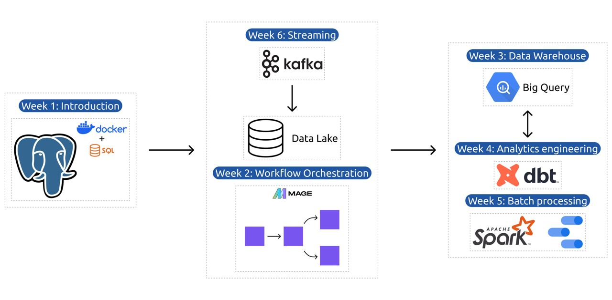

# data_engineering_zoomcamp_2026

Tools & Technologies
1. Infrastructure & Prerequisites	• Set up your development environment with Docker and PostgreSQL
• Learn cloud basics with GCP
• Master infrastructure-as-code using Terraform	Docker, PostgreSQL, GCP, Terraform
2. Workflow Orchestration	• Master data pipeline orchestration with Mage.AI
• Implement and manage Data Lakes using Google Cloud Storage
• Build automated, reproducible workflows	Mage.AI, Google Cloud Storage
3. Data Warehouse	• Deep dive into BigQuery for enterprise data warehousing
• Learn optimization techniques like partitioning and clustering
• Implement best practices for data storage and retrieval	BigQuery
4. Analytics Engineering	• Transform raw data into analytics-ready models using dbt
• Develop testing and documentation strategies
• Create impactful visualizations with modern BI tools	dbt, BI tools
5. Batch Processing	• Process large-scale data with Apache Spark
• Master Spark SQL and DataFrame operations
• Optimize batch processing workflows	Apache Spark, Spark SQL
6. Stream Processing	• Build real-time data pipelines with Kafka
• Develop streaming applications using KSQL and Faust
• Implement stream processing patterns	Kafka, KSQL, Faust
Final Project	• Build an end-to-end data pipeline from ingestion to visualization
• Apply all learned concepts in a real-world project
• Create a portfolio-ready project with documentation	Cloud platforms (GCP/AWS/Azure), Terraform, Spark, Kafka, dbt, BigQuery